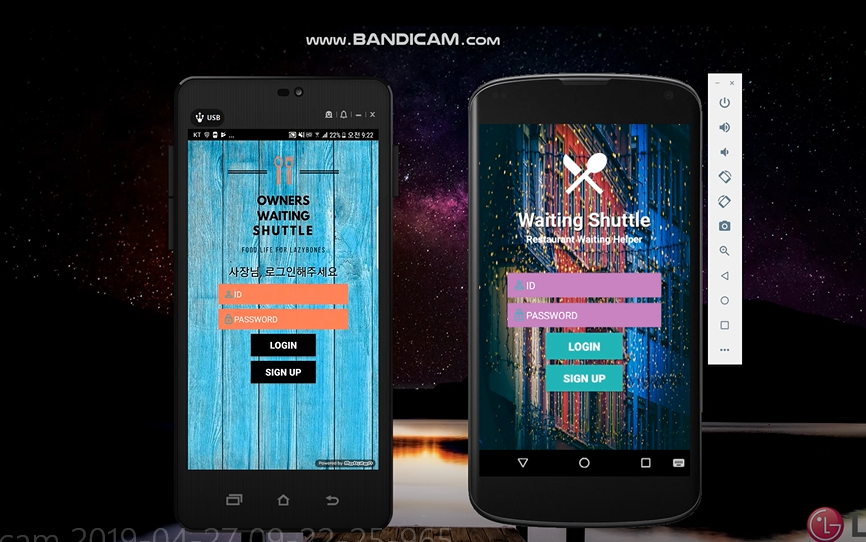
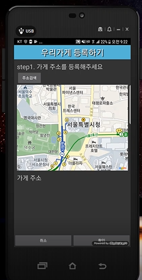
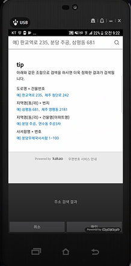
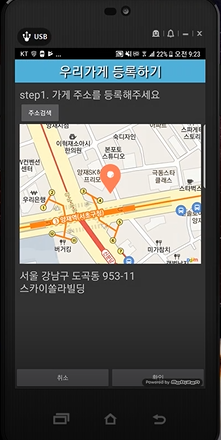
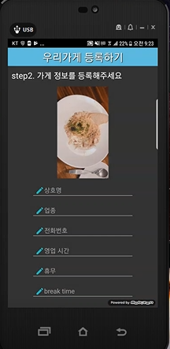
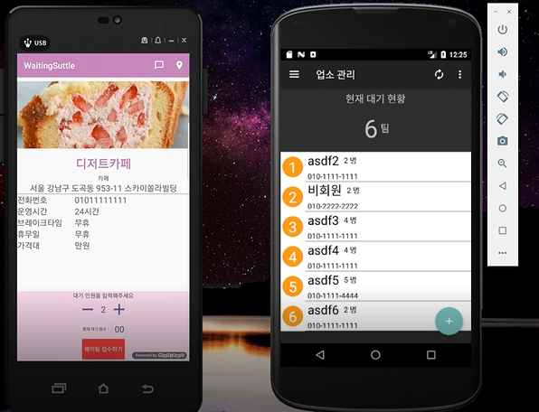

WaitingShuttle / WaitingShuttleForManager
=============
- 구분 : 안드로이드 애플리케이션
- 개발인원 : 1명 (본인)
- 개발 기간 : 2019.01.05 ~ 2019.02.03
- 개발 환경 : AndroidStudio, AWS EC2(Ubuntu)
- 개발 언어 : JAVA, PHP, javascript
- 데이터베이스: MySQL
- 라이브러리 : volley, glide, daum map, daum postcode, TedBottomPicker
- 간단 소개 : 음식점 웨이팅을 도와주는 어플입니다. 일반 소비자용 어플과 음식점 사장님 전용 어플을 나누어 제작했습니다. (WaitingShuttle / WaitingShuttleForManager).

## 시연영상
https://www.youtube.com/watch?v=RY3084cfSgA

## 기능
### WaitingShuttleForManager
#### 1. 음식점 주소 등록
  daum map, postcode api를 이용해 주소 검색, 선택한 주소를 지도에 마커로 표시할 수 있는 기능을 구현했습니다.
  선택한 주소는 서버에 저장됩니다.
#### 2. 음식점 정보 등록
  REST api(Volley)를 통해 음식점 사진과 정보를 서버로 전송할 수 있습니다.
#### 3. 대기인원 관리
  현재 대기중인 인원을 볼 수 있습니다.

### WaitingShuttle
#### 1. 현재 위치 반영
  GPSListener로 현재 위치 정보를 가져옵니다.
#### 2. 음식점 리스트 보여주기
  RecyclerView로 등록된 음식점 리스트를 보여줍니다. 리스트에는 현재 대기 인원이 반영되어 있습니다.
#### 3. 음식점 웨이팅 기능
  음식점 상세 페이지에서 웨이팅이 가능합니다.
#### 4. 지도 
  지도에서 음식점 위치를 확인할 수 있습니다. 사용자의 현재 위치도 볼 수 있어 현재 위치와 음식점 위치 사이의 거리를 고려할 수 있습니다.
 
## 화면
|             로그인              |           가게 등록            |          주소 검색            |
| :-------------------------: | :------------------------------------------------------: | :------------------------------------------------------: |
|  |  |  |
 
|              지도               |              이미지 등록           |           대기인원 등록            |
| :----------------------------: | :-------------------------------: | :-----------------------------------------: |
|  |  |  |

